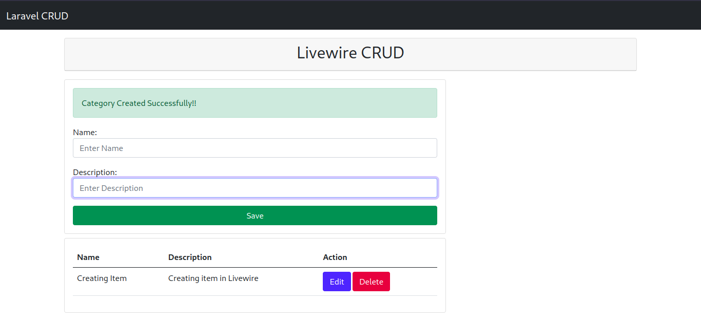
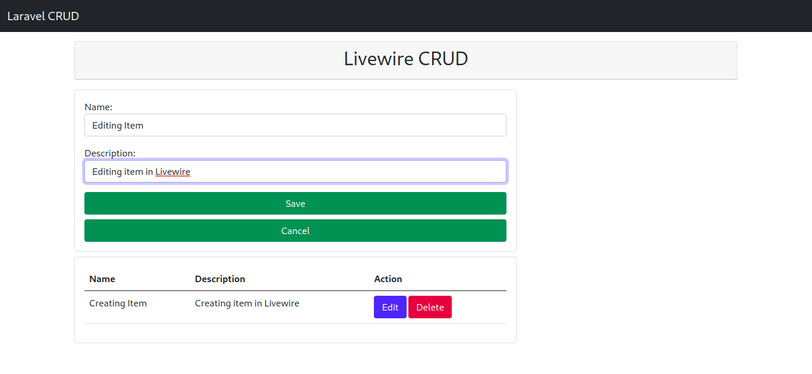
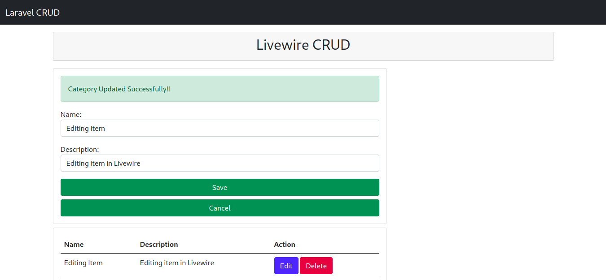

# Larawire CRUD

Larawire CRUD is a application made for learning Laravel and Livewire.

## Screenshots

## Technologies Used

- Bootstrap 5
- Laravel
- Livewire
- MySQL

## Installation

1. Clone the Larawire CRUD repository to your local machine.
2. Configure the database connection settings in the `.env` file.
3. Run `composer install` to install the project dependencies.
4. Run `php artisan migrate` to create the necessary database tables.
5. Run `php artisan serve` to start the development server.
6. Open your browser and access Larawire CRUD at `http://localhost:8000`.

## Contributing

Contributions are welcome! If you'd like to contribute to Larawire CRUD, please follow these steps:

1. Fork the repository.
2. Create a new branch for your feature or bug fix.
3. Make the necessary changes and commit your code.
4. Push your changes to your forked repository.
5. Submit a pull request to the main Larawire CRUD repository.

## License

Larawire CRUD is open-source software licensed under the [MIT license](LICENSE).
